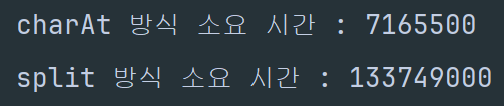

# 11720 - 숫자의 합
## 문제
- N개의 숫자가 공백 없이 쓰여있다. 이 숫자를 모두 합해서 출력하는 프로그램을 작성하시오.

## 입력
- 첫째 줄에 숫자의 개수 N(1<=N<=100)이 주어진다.
- 둘째 줄에 숫자 N개가 공백 없이 주어진다.

## 출력
- 입력으로 주어진 숫자 N개의 합을 출력한다.

## 접근 방식
- 둘째 줄에 입력한 숫자들을 숫자 배열로 쪼개고(split), 숫자 배열 인덱스에 순차적으로 접근해서 숫자를 합하는 방식을 생각함

## 다른 풀이
- `Scanner`로 입력을 받고, 문자열에서 `charAt(i) - '0'`으로 숫자를 추출해서 합산
- `char-'0'`을 하면 숫자로 바뀐다는걸 이번에 처음 이해함.

##  나의 풀이 방식과 비교 분석
### 나의 풀이
````
import.java.util.Scanner;
public class Main{
    public static void main (){
        Scanner sc = new Scanner(System.in);
        int n = sc.nextInt();
        String input = sc.nextLine();
        sc.close();
        String[] digits = input.split("");
        int sum = 0
        for(i=0;i<n;i++){
            sum+=Integer.parseInt(digits[i);
        }
        System.out.println(sum);
    }
}
````
### 다른 풀이
````
import java.util.Scanner;
public class Main{
        public static void main(){
        Scanner sc = new Scanner(System.in);
        int n = sc.nextInt();
        String input = sc.nextLine();
        sc.close();
        int sum = 0;
        for(i=0;i<n;i++){
        sum+=input.charAt(i)-'0';
        }
        System.out.println(sum);        
    }
}
````
### 두 가지 풀이 방식의 효율성 측정 : CompareSumMethods.java
- 결과 : charAt 방식이 좀 더 효율적이었다  
  
